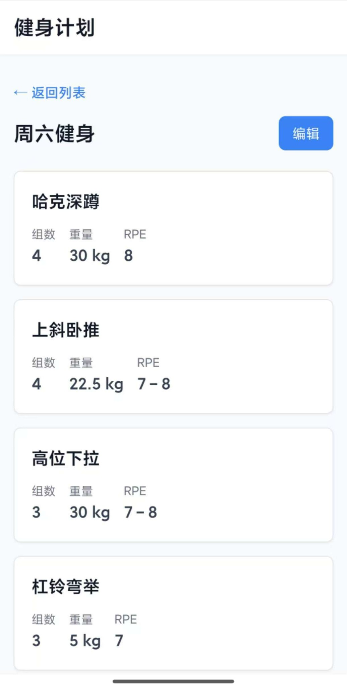

# Workoutpal 

免费、简洁、即开即用。一个保存训练计划的工具。
<p>
  
  
  
  
</p>

## 🌐 在线访问

**GitHub Pages**: [https://imzihuailin.github.io/Workout-Pal](https://imzihuailin.github.io/Workout-Pal)

- ✅ 无需注册，打开即用
- ✅ 数据本地存储
- ✅ 免费无广告

## ✨ 功能特性

- **多计划管理** - 创建和管理多个健身计划
- **动作记录** - 为每个计划添加动作，记录组数、次数、重量、RPE
- **查看与编辑** - 查看模式清晰展示计划，编辑模式快速修改
- **本地存储** - 数据保存在浏览器本地，无需云端同步

## 📖 如何使用

1. **创建计划** - 在首页输入计划名称，点击"添加计划"
2. **查看计划** - 点击计划卡片进入查看模式，浏览所有动作和参数
3. **编辑计划** - 在查看模式下点击"编辑"按钮，可以：
   - 修改计划名称
   - 添加新动作（输入动作名称、组数、次数、重量、RPE）
   - 点击已有动作进行编辑
   - 删除不需要的动作
4. **删除计划** - 在编辑模式下点击右上角"删除计划"

所有操作都会自动保存，关闭浏览器后再次打开，数据依然存在。

## 🛠️ 技术栈

- **React** - 用户界面框架
- **Vite** - 快速构建工具
- **Tailwind CSS** - 实用优先的CSS框架
- **Local Storage** - 浏览器本地存储

## 💻 开发者指南

### 安装

```bash
npm install
```

### 运行

```bash
npm run dev
```

### 构建

```bash
npm run build
```
